<h2>TensorFlow-FlexUNet-Image-Segmentation-SEREBRUM-7T (2026/06/07)</h2>

Sarah T. Arai 
Software Laboratory antillia.com 
 
This is the first experiment of Image Segmentation for <b>SEREBRUM-7T</b>,
 based on our 
TensorFlowFlexUNet (TensorFlow Flexible UNet Image Segmentation Model for Multiclass) 
and a 512x512 pixels PNG 
<a href="https://drive.google.com/file/d/1ovwPweFUWeG1mEiGuzuMG_9nkQo6BJrS/view?usp=sharing">
Augmented-SEREBRUM-7T-ImageMask-Dataset.zip
</a> with colorized masks (CC0), 
which was derived by us from    
<a href="https://openneuro.org/datasets/ds003642/versions/1.1.0">
<b>
CEREBRUM-7T: Fast and Fully-volumetric Brain Segmentation of 7 Tesla MR Volume
</b>
</a>
 

<b>Acutual Image Segmentation for  SEREBRUM-7T Images of 512x512 pixels</b> 
As shown below, the inferred masks predicted by our segmentation model trained on the 
PNG dataset appear similar to the ground truth masks.  
<a href="#color-class-mapping-table">SEREBRUM-7T: class-color mapping table</a>
 
<table>
<tr>
<th>Input: image</th>
<th>Mask (ground_truth)</th>
<th>Prediction: inferred_mask</th>
</tr>
<tr>
<td>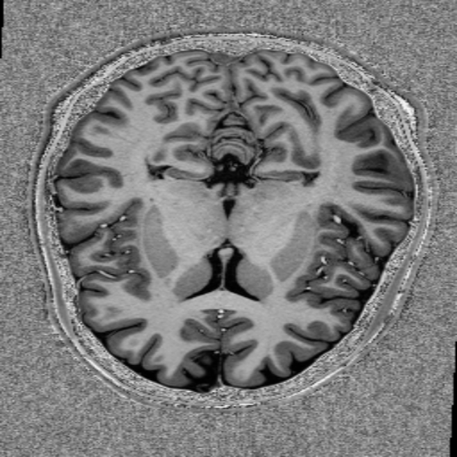</td>
<td></td>
<td>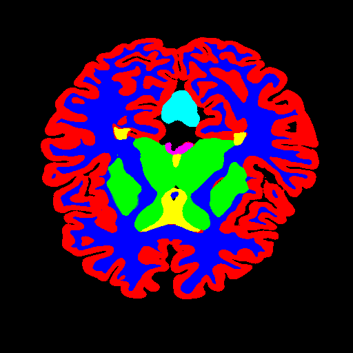</td>
</tr>
<tr>
<td>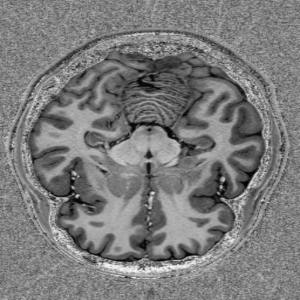</td>
<td>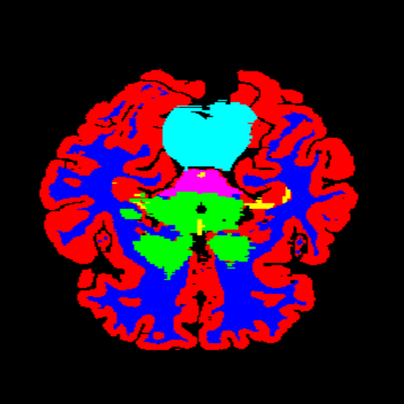</td>
<td>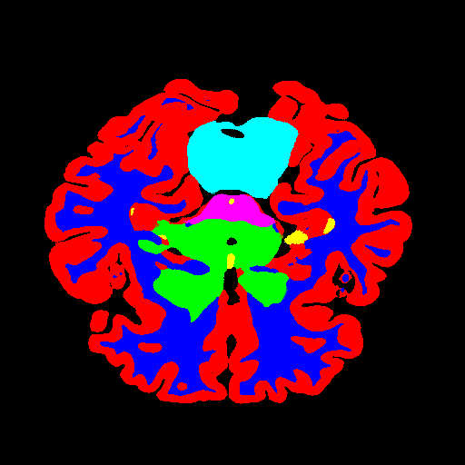</td>
</tr>
<tr>
<td>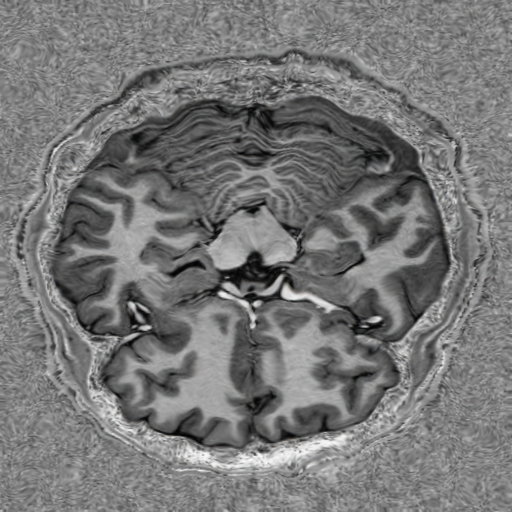</td>
<td>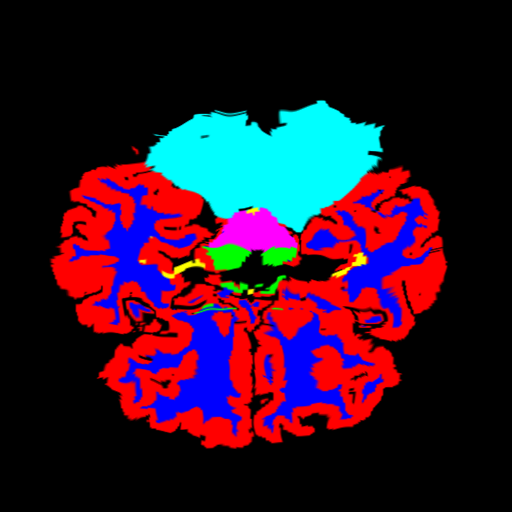</td>
<td>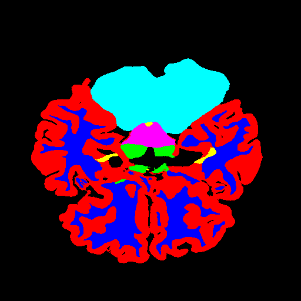</td>
</tr>
</table>

<h3>1. Dataset Citation</h3>
The dataset used here was derived from    
<a href="https://openneuro.org/datasets/ds003642/versions/1.1.0">
<b>
CEREBRUM-7T: Fast and Fully-volumetric Brain Segmentation of 7 Tesla MR Volume
</b>
</a>
  
The following explanation was taken from the above web site.  
Visit the <a href="https://rocknroll87q.github.io/cerebrum7t/">project website</a> for more.  
The dataset is composed by 3 subjects, scanned at the Imaging Centre of Excellence (ICE) at the Queen 
Elizabeth University Hospital, Glasgow (UK).  
The full database consists of 142 out-of-the-scanner volumes obtained with a MP2RAGE sequence at 0.63 mm3 
isotropic resolution, using a 7-Tesla MRI scanner with 32-channel head coil. 
These data serve as testing dataset for the paper:
  
Svanera, M., Benini, S., Bontempi, D., & Muckli, L. (2020).  
CEREBRUM-7T: fast and fully-volumetric brain segmentation of out-of-the-scanner 7T MR volumes.  
bioRxiv.  
For every subject, two folders are provided, containing:  
anat/ 
<ul>
<li>INV1</li>
<li>INV2</li>
<li>UNI_Images (T1w)</li>
</ul>
derivatives 
<ul>
<li>manual annotations of 8 regions of widely interest in neuroscience
early visual cortex (EVC) high-level visual areas (HVC) motor 
cortex (MCX) cerebellum (CER) hippocampus (HIP) early auditory cortex (EAC) brainstem (BST) 
basal ganglia (BGA)</li>
<li>automatic segmentation by FreeSurfer (v6 and v7)</li>
<li>automatic segmentation by Fracasso16</li>
<li>automatic segmentation by our method (CEREBRUM7T) with probability maps (CEREBRUM7T_probMap)</li>
<li>automatic segmentation by nighres</li>
<li>labels used for training our method</li>
</ul>
 
<b>Citation</b> 
Michele Svanera and Lars Muckli (2021).  
CEREBRUM-7T: Fast and Fully-volumetric Brain Segmentation of 7 Tesla MR Volumes.  
OpenNeuro. [Dataset] doi: 10.18112/openneuro.ds003642.v1.1.0
  
<b>License</b> 
CC0
  
<h3>
2 SEREBRUM-7T ImageMask Dataset
</h3>
<h4>2.1 Download ImageMask Dataset</h4>
 If you would like to train this SEREBRUM-7T Segmentation model by yourself,
 please download the dataset from the google drive 
<a href="https://drive.google.com/file/d/1ovwPweFUWeG1mEiGuzuMG_9nkQo6BJrS/view?usp=sharing">
Augmented-SEREBRUM-7T-ImageMask-Dataset.zip
</a> (CC0), 
which was derived by us from    , 
expand the downloaded dataset, and put it under <b>./dataset</b> folder to be:
<pre>
./dataset
└─SEREBRUM-7T
    ├─test
    │   ├─images
    │   └─masks
    ├─train
    │   ├─images
    │   └─masks
    └─valid
        ├─images
        └─masks
</pre>
 
<b>SEREBRUM-7T Statistics</b> 
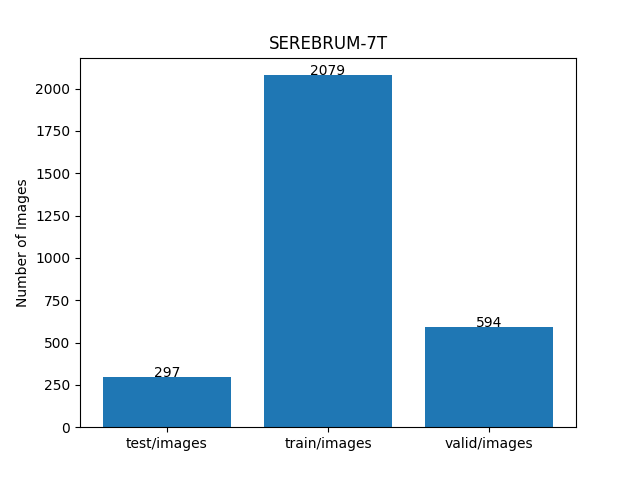 
 
As shown above, the number of images of train and valid datasets is large enough to use for a training set of our segmentation model.
 
 
<h4>2.2 ImageMask Dataset Derivation</h4>
The folder structure of <b>synapse dataset</b> is the following. 
<pre>
./SEREBRUM-7T
  ├─derivatives
  │   ├─sub-025
  │   │    └─sub-025_ses-003_training_labels.nii.gz
.. 
  │   └─sub-075
  │         └─sub-075_ses-003_training_labels.nii.gz
...
  └─images_dir
       ├─sub-025
       │    └─ses-003
       │         └─anat
                       └─sub-045_ses-002_T1w.nii.gz
...
       └─sub-075
             └─ses-001
                  └─anat
.                      └─sub-075_ses-003_T1w.nii.gz
</pre>
<b>Step 1</b> 
We used a simple Python script and the following color-class-mapping table to generatea a 512x512 pixels PNG master dataset 
with colorized masks from all pairs of <b>*_T1w.nii.gz</b> file under <b>images_dir</b> folder and 
their corresponding <b>*_training_labels.nii.gz</b> file under <b>derivatives</b> folder.  
<a id="color-class-mapping-table"><b>SEREBRUM-7T color class mapping table</b></a>
  
<table border=1 style='border-collapse:collapse;' cellpadding='5'>
<tr><th>Indexed Color</th><th>Color</th><th>RGB</th><th>Class</th></tr>
<tr><td>0</td><td with='80' height='auto'></td><td>(0, 0, 0)</td><td>Background</td></tr>
<tr><td>1</td><td with='80' height='auto'></td><td>(255, 0, 0)</td><td>Early Visual Cortex (EVC)</td></tr>
<tr><td>2</td><td with='80' height='auto'></td><td>(0, 255, 0)</td><td>High-level Visual Areas (HVC)</td></tr>
<tr><td>3</td><td with='80' height='auto'></td><td>(0, 0, 255)</td><td>Motor Cortex (MCX)</td></tr>
<tr><td>4</td><td with='80' height='auto'></td><td>(255, 255, 0)</td><td>Cerebellum (CER)</td></tr>
<tr><td>5</td><td with='80' height='auto'></td><td>(0, 255, 255)</td><td>Hippocampus (HIP)</td></tr>
<tr><td>6</td><td with='80' height='auto'></td><td>(255, 0, 255)</td><td>Early Auditory Cortex (EAC)</td></tr>
<tr><td>7</td><td with='80' height='auto'></td><td>(128, 128, 0)</td><td>Brainstem (BST)</td></tr>
<tr><td>8</td><td with='80' height='auto'></td><td>(0, 128, 128)</td><td>Basal Ganglia (BGA)</td></tr>
</table>
 
For simplicity, we excluded all empty black label slices and their corresponding image slices to generate the PNG master, 
because they were irrelevant to training our segmentation model.
  
<b>Step 2</b> 
We generated our augmented dataset from the PNG master by using the following image deformation and distortion tools. 
<a href="https://github.com/sarah-antillia/Image-Deformation-Tool">Image-Deformation-Tool</a> 
<a href="https://github.com/sarah-antillia/Image-Distortion-Tool">Image-Distortion-Tool</a>  
 
<h4>2.3 Image and Mask samples</h4>
<b>Train sample images</b> 
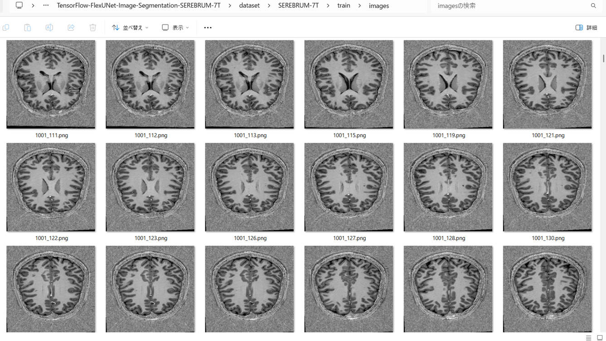
 
<b>Train sample masks</b> 
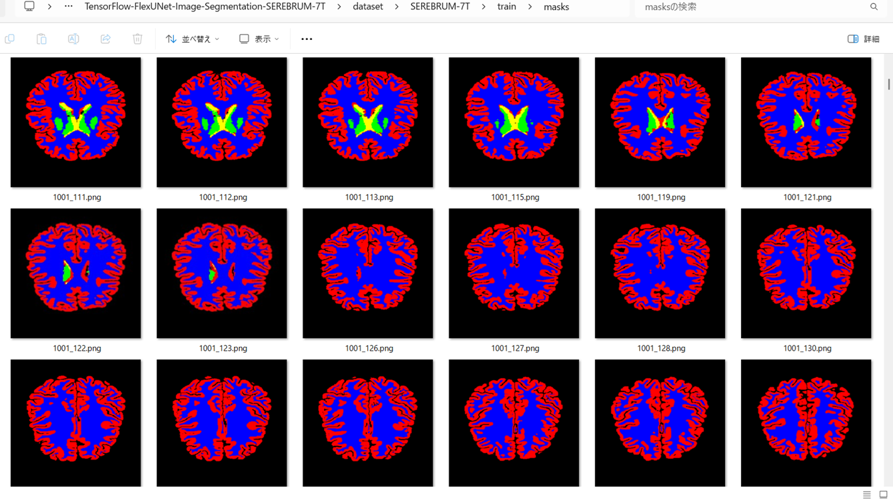
 
 
<h3>
3 Train TensorFlowFlexUNet Model
</h3>
 We trained SEREBRUM-7T TensorFlowFlexUNet Model by using the following
<a href="./projects/TensorFlowFlexUNet/SEREBRUM-7T/train_eval_infer.config"> <b>train_eval_infer.config</b></a> file.  
Please move to ./projects/TensorFlowFlexUNet/SEREBRUM-7T and run the following bat file. 
<pre>
>1.train.bat
</pre>
, which simply runs the following command. 
<pre>
>python ../../../src/TensorFlowFlexUNetTrainer.py ./train_eval_infer.config
</pre>

<b>Model parameters</b> 
Defined a small <b>base_filters = 16 </b> and large <b>base_kernels = (11,11)</b> for the first Conv Layer of Encoder Block of 
<a href="./src/TensorFlowFlexUNet.py">TensorFlowFlexUNet.py</a> 
and a large <b>num_layers = 8</b> (including a bridge between Encoder and Decoder Blocks).
<pre>
[model]
;You may specify your own UNet class derived from our TensorFlowFlexModel
model         = "TensorFlowFlexUNet"
generator     =  False
image_width    = 512
image_height   = 512
image_channels = 3
num_classes    = 9
base_filters   = 16
base_kernels   = (11,11)
num_layers     = 8
dropout_rate   = 0.05
dilation       = (1,1)
</pre>
<b>Learning rate</b> 
Defined a very small learning rate.  
<pre>
[model]
learning_rate  = 0.00007
</pre>
<b>Loss and metrics functions</b> 
Specified "categorical_crossentropy" and <a href="./src/dice_coef_multiclass.py">"dice_coef_multiclass"</a>. 
<pre>
[model]
loss           = "categorical_crossentropy"
metrics        = ["dice_coef_multiclass"]
</pre>
<b>Dataset class</b> 
Specifed <a href="./src/ImageCategorizedMaskDataset.py">ImageCategorizedMaskDataset</a> class. 
<pre>
[dataset]
class_name    = "ImageCategorizedMaskDataset"
</pre>
 
<b>Learning rate reducer callback</b> 
Enabled learing_rate_reducer callback, and a small reducer_patience.
<pre> 
[train]
learning_rate_reducer = True
reducer_factor     = 0.5
reducer_patience   = 4
</pre>
<b>Early stopping callback</b> 
Enabled early stopping callback with patience parameter.
<pre>
[train]
patience      = 10
</pre>

<b>RGB Color map</b> 
rgb color map dict for SEREBRUM-7T 1+8 classes. 
<pre>
[mask]
mask_datatyoe    = "categorized"
mask_file_format = ".png"
; SEREBRUM-7T 1+8 classes
;       
rgb_map = {(0,0,0):0, (255,0,0,):1, (0,255,0):2, (0,0,255):3, (255, 255, 0):4, \
          (0,255,255):5, (255,0,255):6, (128,128,0):7, (0,128,128):8}
                       
  </pre>

<b>Epoch change inference callback</b> 
Enabled <a href="./src/EpochChangeInfereuncer.py">epoch_change_infer callback</a></b>. 
<pre>
[train]
epoch_change_infer       = True
epoch_change_infer_dir   =  "./epoch_change_infer"
num_infer_images         = 6
</pre>

By using this callback, on every epoch_change, the inference procedure can be called
 for 6 images in <b>mini_test</b> folder. This will help you confirm how the predicted mask changes 
 at each epoch during your training process.    

<b>Epoch_change_inference output at starting (epoch 1,2,3)</b> 
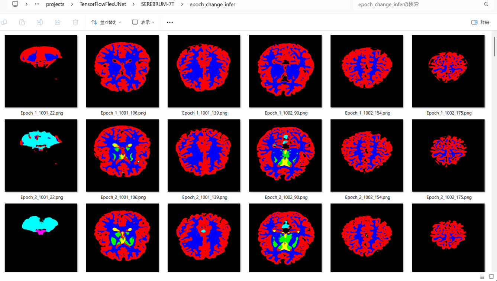 
 
<b>Epoch_change_inference output at middlepoint (epoch 23,24,25)</b> 
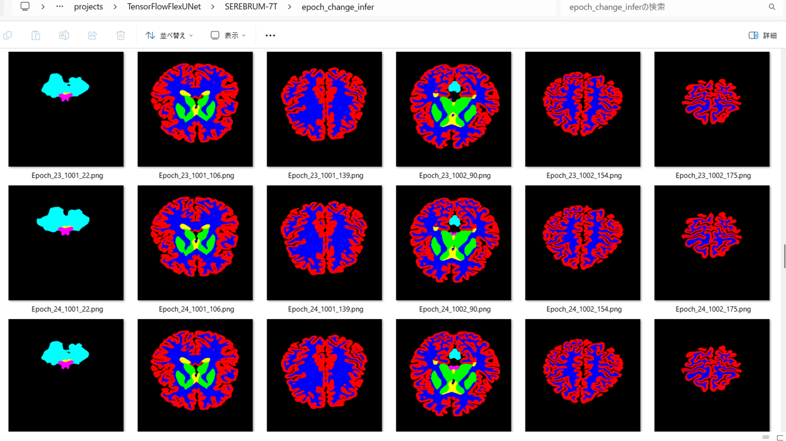 
 
<b>Epoch_change_inference output at ending (epoch 48,49,50)</b> 
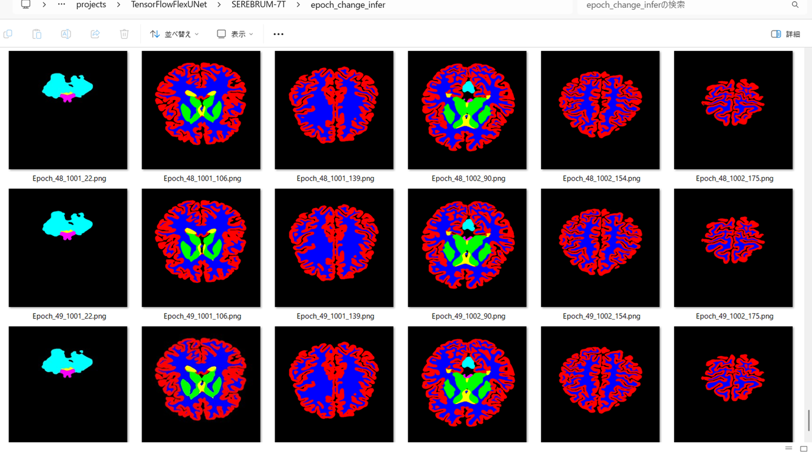 
 
In this experiment, the training process was terminated at epoch 50.  
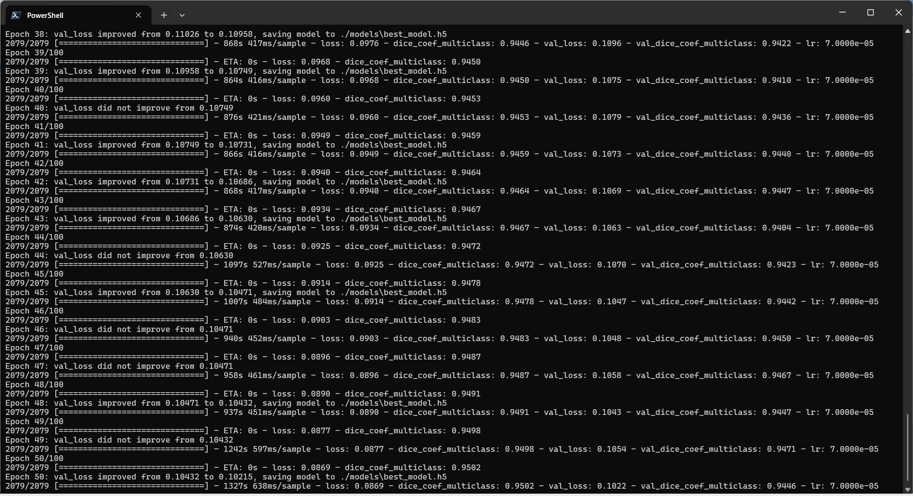 
 

<a href="./projects/TensorFlowFlexUNet/SEREBRUM-7T/eval/train_metrics.csv">train_metrics.csv</a> 
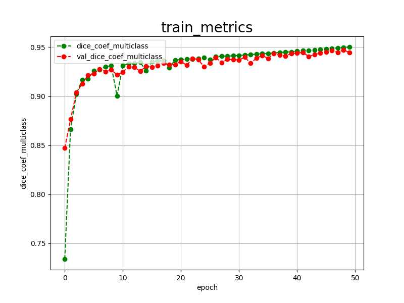 

 
<a href="./projects/TensorFlowFlexUNet/SEREBRUM-7T/eval/train_losses.csv">train_losses.csv</a> 
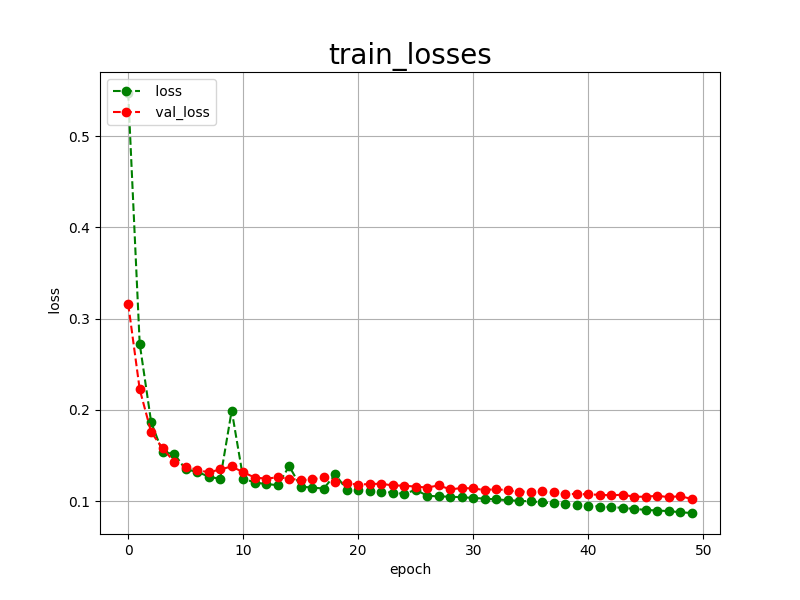 
 
<h3>
4 Evaluation
</h3>
Please move to <b>./projects/TensorFlowFlexUNet/SEREBRUM-7T</b> folder, 
and run the following bat file to evaluate TensorFlowFlexUNet model for SEREBRUM-7T. 
<pre>
./2.evaluate.bat
</pre>
This bat file simply runs the following command.
<pre>
python ../../../src/TensorFlowFlexUNetEvaluator.py ./train_eval_infer.config
</pre>

Evaluation console output: 
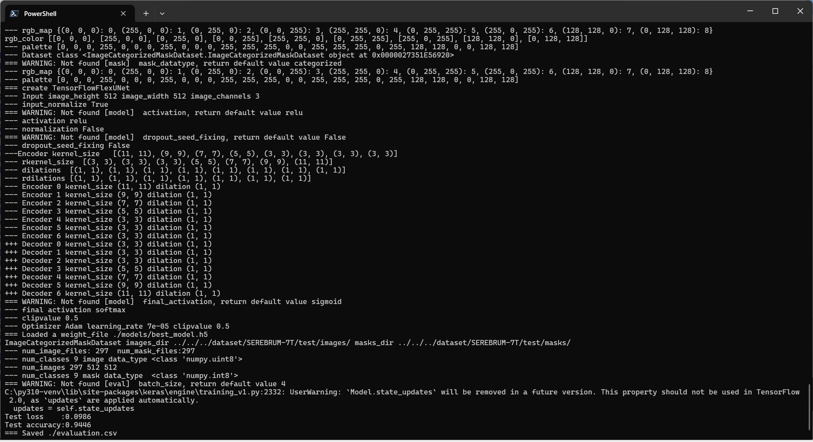
  

<a href="./projects/TensorFlowFlexUNet/SEREBRUM-7T/evaluation.csv">evaluation.csv</a> 
The loss (categorical_crossentropy) to this SEREBRUM-7T/test was not low, and dice_coef_multiclass not high as shown below.
 
<pre>
categorical_crossentropy,0.0986
dice_coef_multiclass,0.9446
</pre>
 

<h3>
5 Inference
</h3>
Please move to <b>./projects/TensorFlowFlexUNet/SEREBRUM-7T</b> folder 
,and run the following bat file to infer segmentation regions for images by the Trained-TensorFlowFlexUNet model for SEREBRUM-7T. 
<pre>
>./3.infer.bat
</pre>
This simply runs the following command.
<pre>
>python ../../../src/TensorFlowFlexUNetInferencer.py ./train_eval_infer.config
</pre>

<b>mini_test_images</b> 
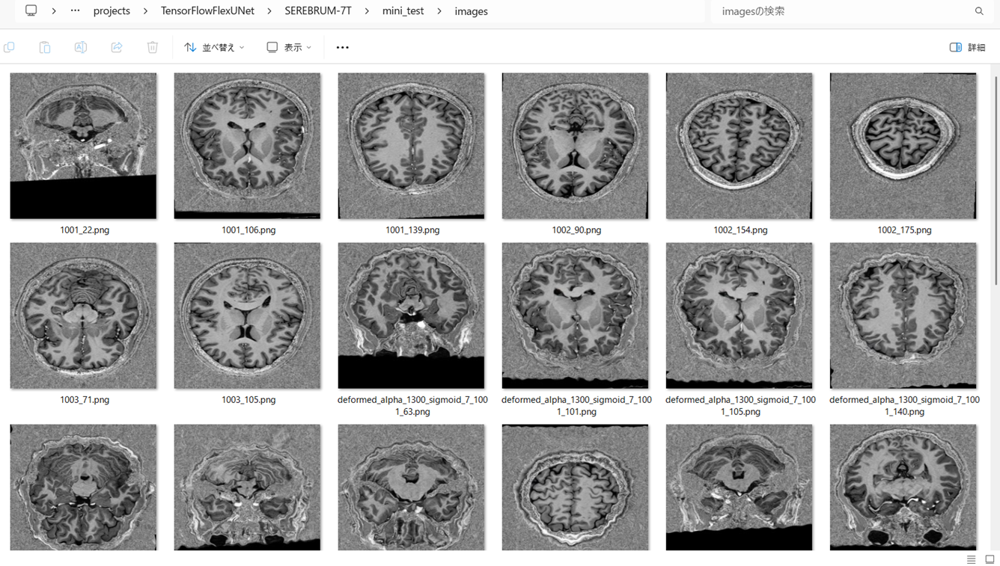 
<b>mini_test_mask(ground_truth)</b> 
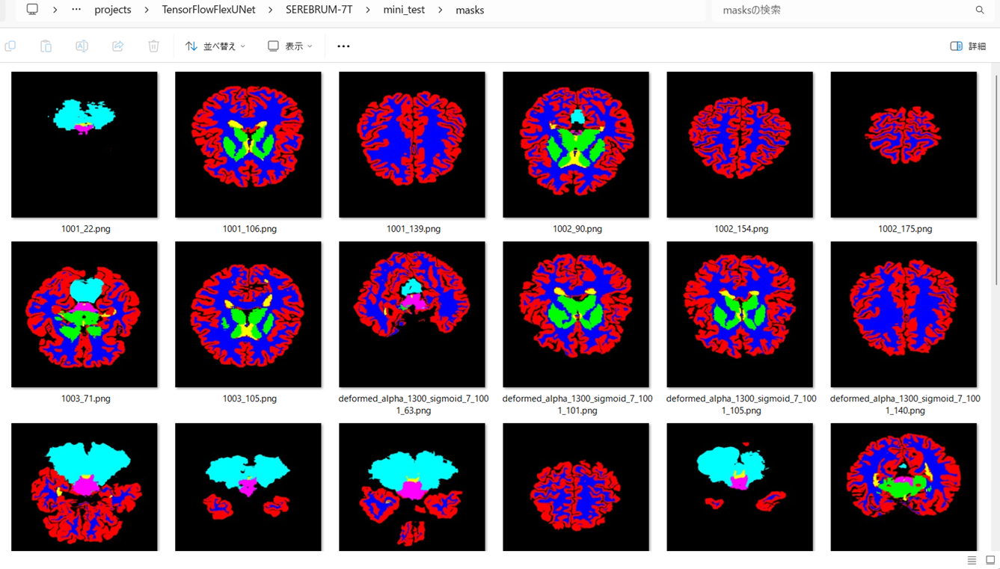 

<b>Inferred test masks</b> 
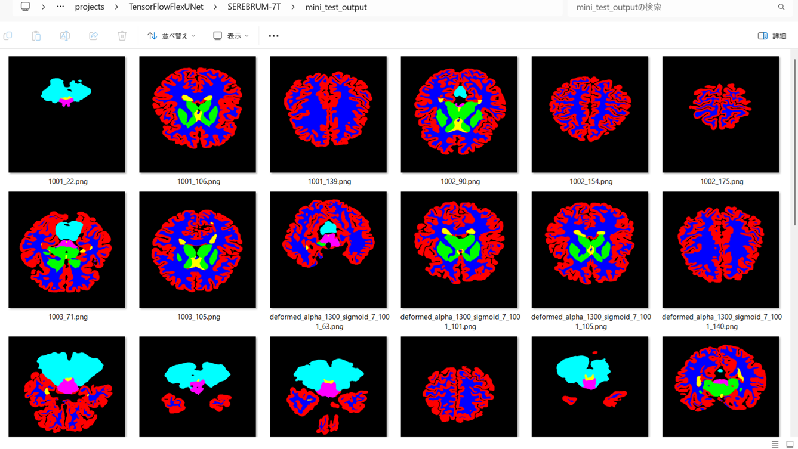 
 

<b>Enlarged images and masks for  SEREBRUM-7T Images of 512x512 pixels</b> 
As shown below, the inferred masks predicted by our segmentation model trained on the 
PNG dataset appear similar to the ground truth masks.  
<a href="#color-class-mapping-table">SEREBRUM-7T: class-color mapping table</a>
<table>
<tr>
<th>Image</th>
<th>Mask (ground_truth)</th>
<th>Inferred-mask</th>
</tr>

<tr>
<td>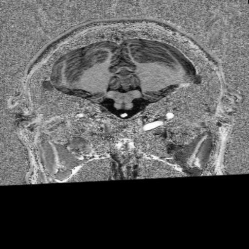</td>
<td>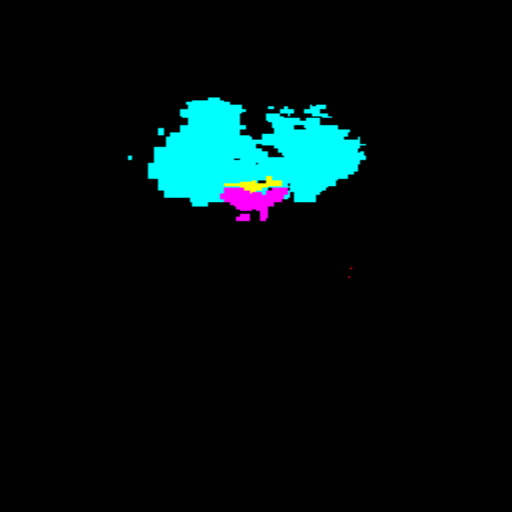</td>
<td>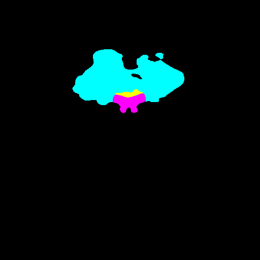</td>
</tr>

<tr>
<td></td>
<td></td>
<td></td>
</tr>

<tr>
<td>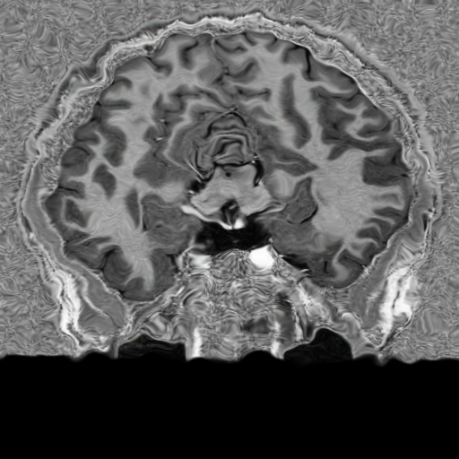</td>
<td>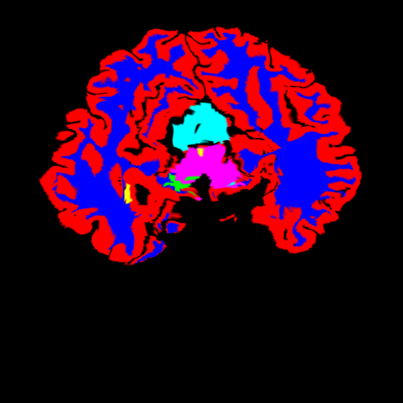</td>
<td>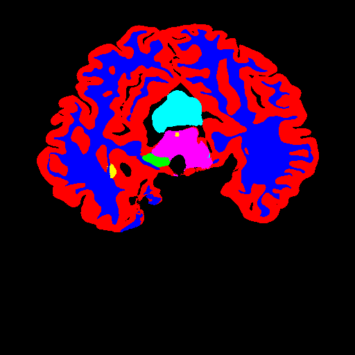</td>
</tr>

<tr>
<td>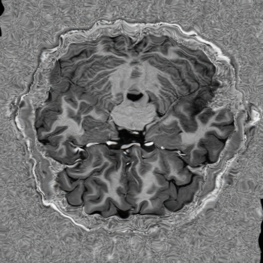</td>
<td>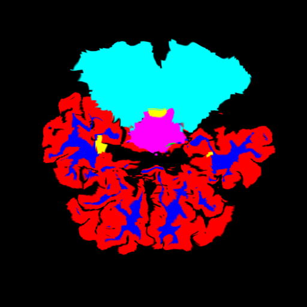</td>
<td>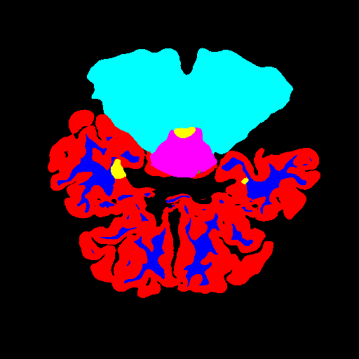</td>
</tr>

<tr>
<td></td>
<td></td>
<td></td>
</tr>

<tr>
<td>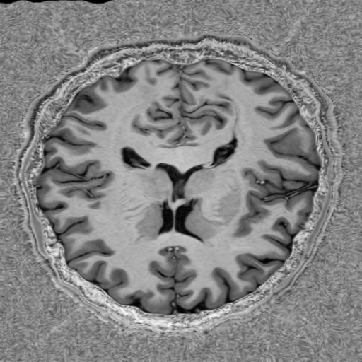</td>
<td>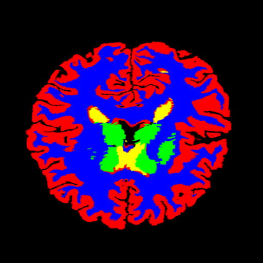</td>
<td>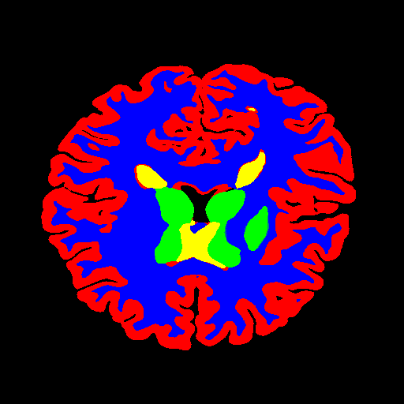</td>
</tr>
</table>

 

<h3>
6 3D Volume Segmentation
</h3>
Please move to <b>./projects/TensorFlowFlexUNet/SEREBRUM-7T</b> folder 
,and run the following bat file to infer images segmentation for 2D slices of 3D volume NIfTI files
 by the Trained-TensorFlowFlexUNet model for SEREBRUM-7T. 
<pre>
>./5.infer3d.bat
</pre>
This simply runs the following command.
<pre>
>python ../../../src/TensorFlowFlexUNet3DInferencer.py ./train_eval_infer.config
</pre>
<b>infer3d section </b> in <a href="./projects/TensorFlowFlexUNet/SEREBRUM-7T/train_eval_infer.config">
train_eval_infer.config
<a></b>
<pre>
[infer3d] 
;Specify an images_dir which contains NIfTI or NPY files
images_dir    = "./mini_test_3d/images/"
output_dir    = "./mini_test_3d_output/"
slice_shape_order = "hwd"
slice_normalize = True
slice_resize   = (512,512)
;Specify a cv2.rotation code as a string.
slice_rotation = "cv2.ROTATE_90_CLOCKWISE" 
</pre>

<b>Acutual Image Segmentation for 2D Slices of a SEREBRUM-7T NIfTI</b> 
Some Slices, Inferred Masks and Mask overlays for a 3D volume <b>sub-045_ses-002_T1w.nii.gz</b> file in <b>images_dir/sub-045</b> folder.
 folder. 
 
<a href="#color-class-mapping-table">SEREBRUM-7T: class-color mapping table</a>
 
<table>
<tr>
<th>Image</th>
<th>Inferred-mask</th>
<th>Mask overlay</th>
</tr>

<tr>
<td>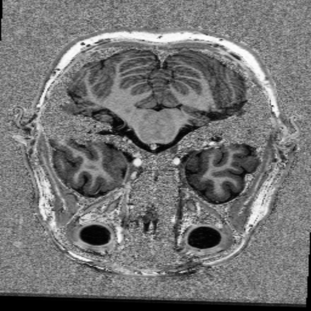</td>
<td>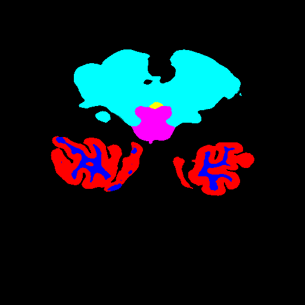</td>
<td>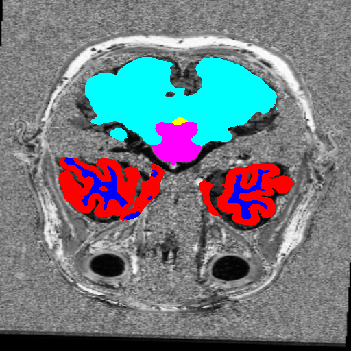</td>
</tr>

<tr>
<td>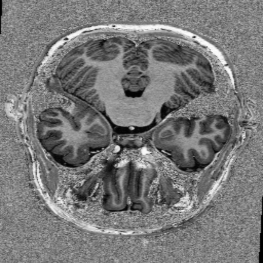</td>
<td>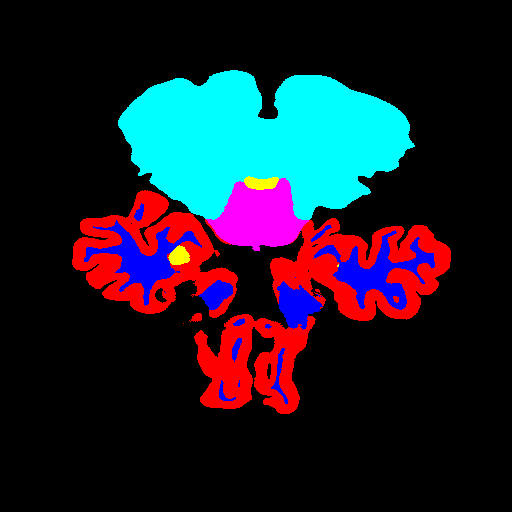</td>
<td>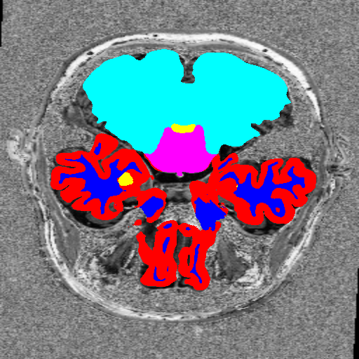</td>
</tr>
<tr>
<td>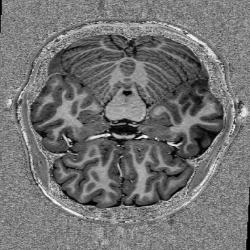</td>
<td>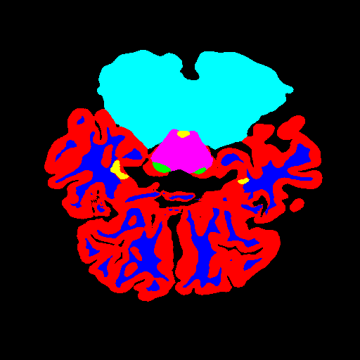</td>
<td>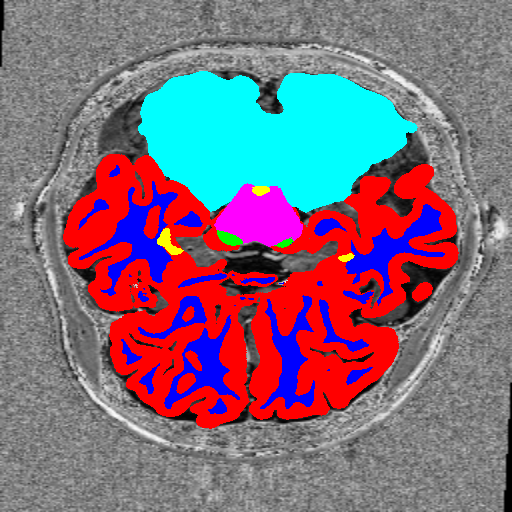</td>
</tr>
<tr>
<td>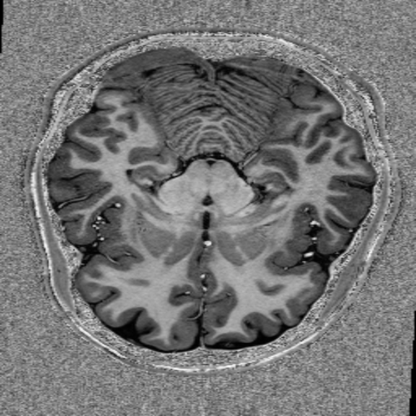</td>
<td>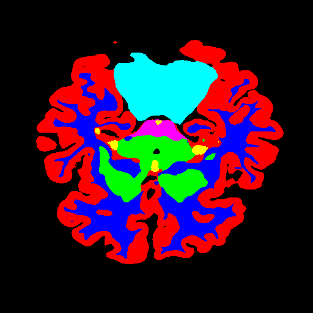</td>
<td>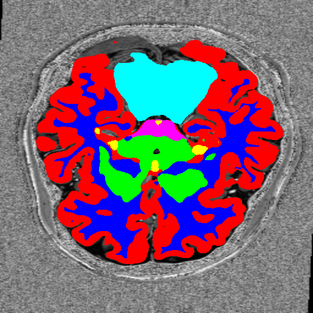</td>
</tr>
<tr>
<td>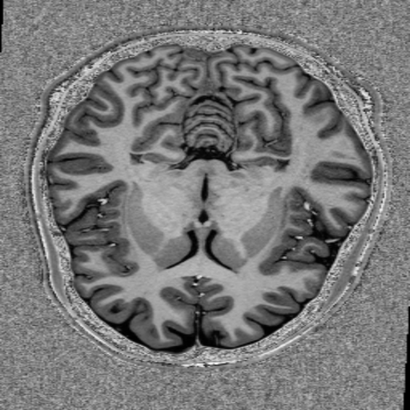</td>
<td>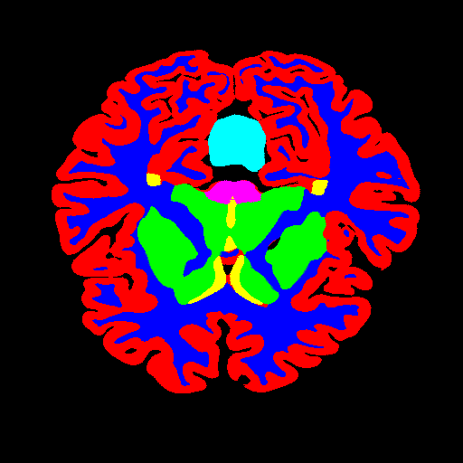</td>
<td>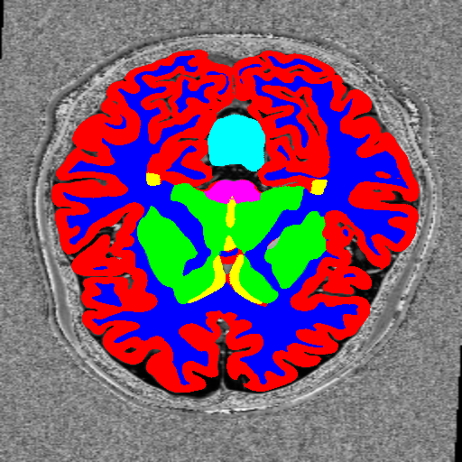</td>
</tr>
<tr>
<td>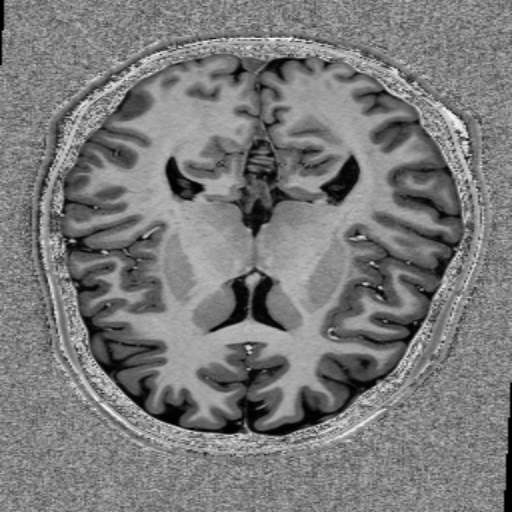</td>
<td>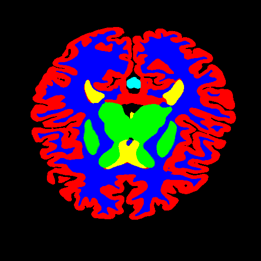</td>
<td>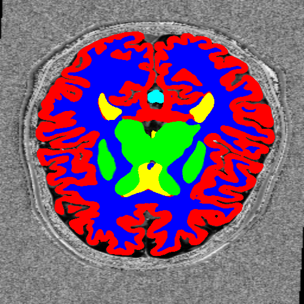</td>
</tr>

</table>

 
<h3>
7 MaskOverlay Video of 3D Volume Segmentation
</h3>
Please move to <b>./projects/TensorFlowFlexUNet/SEREBRUM-7T</b> folder, and run the following bat file 
to generate <b>overlays.mp4</b> or <b>overlay.gif</b> for MaskOverlays of 3D Volume Segmentation.  
<pre>
>./6.video3d.bat
</pre>
This simply runs the following command.
<pre>
>python ../../../src/MaskOverlayVideoGenerator.py ./train_eval_infer.config
</pre>
 
<b>infer3d section </b> in <a href="./projects/TensorFlowFlexUNet/SEREBRUM-7T/train_eval_infer.config">
train_eval_infer.config
<a></b>
<pre>
[infer3d] 
mask_overlay  = True
;Specify ".mp4" or ".gif".
;video_fileformat  = ".mp4"
video_fileformat  = ".gif"
</pre>
 
<b>overlays.gif</b> 

 
 
<h3>
References
</h3>
<b>1. CEREBRUM-7T: Fast and Fully Volumetric Brain Segmentation of 7 Tesla MR Volumes</b> 
Michele Svanera, Sergio Benini, Dennis Bontempi, Lars Muckli  
<a href="https://pmc.ncbi.nlm.nih.gov/articles/PMC8559470/">https://pmc.ncbi.nlm.nih.gov/articles/PMC8559470/</a>
  
<b>2. CEREBRUM 7T</b> 
<b>Fast and Fully-volumetric Brain Segmentation of 7 Tesla MR Volumes</b> 
rocknroll87q 
<a href="https://rocknroll87q.github.io/cerebrum7t/">https://rocknroll87q.github.io/cerebrum7t/</a>
  
<b>3. TensorFlow-FlexUNet-Image-Segmentation-Model</b> 
Toshiyuki Arai 
<a href="https://github.com/sarah-antillia/TensorFlow-FlexUNet-Image-Segmentation-Model">
https://github.com/sarah-antillia/TensorFlow-FlexUNet-Image-Segmentation-Model
</a>

